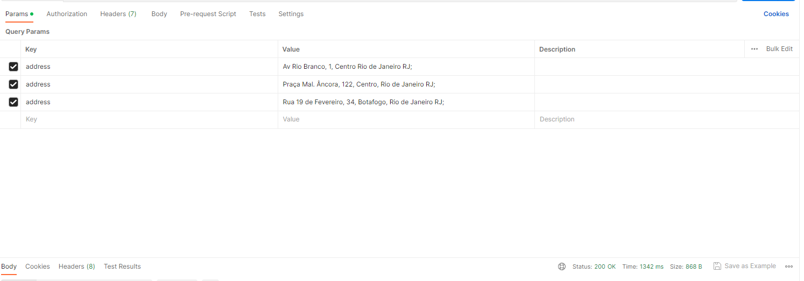

## Distance checker

#### O Distance Checker é um projeto educacional que visa analisar a escrita de código e realizar análises de distância entre endereços fornecidos pelos usuários. A API foi desenvolvida para calcular e apresentar os endereços mais próximos e mais distantes com base nas informações fornecidas. O objetivo principal é auxiliar na visualização e compreensão das distâncias entre diferentes locais.

## Índice

-   [Guia de uso](#guia-de-uso)
    -   [Pré-requisitos ambiente local](#pre-requisitos-local)
    -   [Pré-requisitos docker](#pre-requisitos-docker)
-   [Executar](#executar-api)
    -   [ambiente local](#ambiente-local)
    -   [ambiente docker](#ambiente-docker)
-   [Uso](#uso-api)

## <a name="guia-de-uso"></a>Guia de uso
### <a name="pre-requisitos-local"></a>Pré-requisitos ambiente local
Antes de começar, certifique-se de ter os seguintes requisitos instalados no seu sistema:

- Java 17: Certifique-se de ter o JDK (Java Development Kit) 17 ou uma versão superior instalada no seu sistema.
- Maven: O projeto requer o Apache Maven para gerenciamento de dependências e compilação. Certifique-se de ter o Maven instalado no seu sistema.

### <a name="pre-requisitos-docker"></a>Pré-requisitos docker
Antes de começar, certifique-se de ter os seguintes requisitos instalados no seu sistema:
- docker

### <a name="executar-api"></a>Executar
### <a name="ambiente-local"></a>ambiente local
No diretório raiz do projeto execute o comando
````
spring-boot:run  
````

### <a name="ambiente-docker"></a>ambiente docker
#### Observação: Este processo pode levar tempo.
No diretório raiz do projeto execute o comando
````
docker build -t distance-checker . ; docker run -p 8080:8080 distance-checker
````
### <a name="uso-api"></a>Uso
#### Observação: Para garantir o correto funcionamento do processo, é necessário fornecer no mínimo três endereços e utilizar o ponto e vírgula " ; " como separador para indicar o fim de cada endereço.
- http://localhost:8080/swagger-ui/index.html#/
````
curl -X 'GET' \
  'http://localhost:8080/address?address=Av%20Rio%20Branco%2C%201%2C%20Centro%20Rio%20de%20Janeiro%20RJ%3BPra%C3%A7a%20Mal.%20%C3%82ncora%2C%20122%2C%20Centro%2C%20Rio%20de%20Janeiro%20RJ%3BRua%2019%20de%20Fevereiro%2C%2034%2C%20Botafogo%2C%20Rio%20de%20Janeiro%20RJ%3B' \
  -H 'accept: application/json'
````


